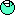
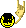
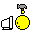
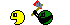
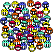
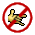
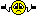

# Справочник по языку разметки RSDN Formatter

## Краткая справочная таблица

### Теги форматирования

| Категория                 | Тег                                    | Описание                              |
|---------------------------|----------------------------------------|---------------------------------------|
| **Форматирование текста** | `[b]...[/b]`                           | **Жирный текст**                      |
|                           | `[i]...[/i]`                           | *Курсив*                              |
|                           | `[u]...[/u]`                           | <u>Подчёркнутый текст</u>             |
|                           | `[s]...[/s]`                           | ~~Зачёркнутый текст~~                 |
|                           | `[sub]...[/sub]`                       | Подстрочный индекс (H[sub]2[/sub]O)   |
|                           | `[sup]...[/sup]`                       | Надстрочный индекс (E=mc[sup]2[/sup]) |
| **Ссылки**                | `[url]URL[/url]`                       | Ссылка                                |
|                           | `[url=URL]текст[/url]`                 | Ссылка с текстом                      |
|                           | `[email]email[/email]`                 | Email-ссылка                          |
| **Изображения**           | `[img]URL[/img]`                       | Изображение                           |
|                           | `[img=small]URL[/img]`                 | Маленькое изображение                 |
|                           | `[img=large]URL[/img]`                 | Большое изображение                   |
| **Цитирование**           | `[quote]...[/quote]`                   | Блочная цитата                        |
|                           | `[quote=автор]...[/quote]`             | Цитата с указанием автора             |
|                           | `[q]...[/q]`                           | Inline-цитата                         |
|                           | `A> текст`                             | Префикс цитирования (одиночный)       |
|                           | `B>> текст`                            | Префикс цитирования (вложенный)       |
| **Структура**             | `[cut]...[/cut]`                       | Скрытый текст (спойлер)               |
|                           | `[cut=заголовок]...[/cut]`             | Спойлер с заголовком                  |
|                           | `[hr]`                                 | Горизонтальная линия                  |
|                           | `[h1]...[/h1]` – `[h6]...[/h6]`        | Заголовки 1–6 уровня                  |
| **Списки**                | `[list][*]пункт...[/list]`             | Маркированный список                  |
|                           | `[list=1][*]пункт...[/list]`           | Нумерованный (арабские цифры)         |
|                           | `[list=a][*]пункт...[/list]`           | Нумерованный (строчные буквы)         |
|                           | `[list=A][*]пункт...[/list]`           | Нумерованный (прописные буквы)        |
|                           | `[list=i][*]пункт...[/list]`           | Нумерованный (римские цифры)          |
| **Таблицы**               | `[table][tr][td]...[/td][/tr][/table]` | Таблица                               |
|                           | `[th]...[/th]`                         | Ячейка заголовка таблицы              |
| **Код**                   | `[code]...[/code]`                     | Блок кода без подсветки               |
|                           | `[code=язык]...[/code]`                | Блок кода с подсветкой                |

### Поддерживаемые языки для подсветки

| Язык          | Синонимы тегов             |
|---------------|----------------------------|
| C#            | `c#`, `cs`, `csharp`       |
| C/C++         | `c`, `cpp`, `c++`, `ccode` |
| Visual Basic  | `vb`, `vbnet`, `vbcode`    |
| Java          | `java`                     |
| JavaScript    | `js`, `javascript`         |
| TypeScript    | `ts`, `typescript`         |
| Python        | `python`, `py`             |
| SQL           | `sql`                      |
| XML/HTML      | `xml`, `html`              |
| CSS           | `css`                      |
| PHP           | `php`                      |
| Ruby          | `ruby`                     |
| Go            | `go`                       |
| Rust          | `rust`                     |
| Assembler     | `asm`, `assembly`          |
| Pascal/Delphi | `pascal`, `delphi`         |
| Nemerle       | `nemerle`                  |
| Nitra         | `nitra`                    |
| Objective-C   | `objc`, `objectivec`       |

### Смайлики

| Код             | Описание           | Образец |
|-----------------|--------------------|---------|
| `:-)` или `:)`  | Улыбка             |  |
| `:-(` или `:(`  | Грусть             |  |
| `;-)` или `;)`  | Подмигивание       |  |
| `:-D` или `:D`  | Широкая улыбка     |  |
| `:-/` или `:-\` | Скептицизм         |  |
| `:-))`          | Широкая улыбка     |  |
| `:-)))`         | LOL (громкий смех) |  |
| `:up:`          | Палец вверх        |  |
| `:down:`        | Палец вниз         |  |
| `:super:`       | Супер!             |  |
| `:shuffle:`     | Перетасовка        |  |
| `:crash:`       | Крах/падение       |  |
| `:maniac:`      | Маньяк             |  |
| `:user:`        | Пользователь       |  |
| `:wow:`         | Вау!               |  |
| `:beer:`        | Пиво               |  |
| `:team:`        | Команда            |  |
| `:no:`          | Нет                |  |
| `:nopont:`      | Нет понтов         |  |
| `:xz:`          | ХЗ (не знаю)       |  |
| `:???:`         | Запутался          |  |
| `:facepalm:`    | Facepalm           |  |
| `:sarcasm:`     | Сарказм           |  |

---

## Подробное описание тегов

### Форматирование текста

#### Жирный текст `[b]`

**Синтаксис:** `[b]текст[/b]`

**Пример:**
```
Это [b]важный[/b] текст.
```

**Результат:** Это **важный** текст.

---

#### Курсив `[i]`

**Синтаксис:** `[i]текст[/i]`

**Пример:**
```
Это [i]курсивный[/i] текст.
```

**Результат:** Это *курсивный* текст.

---

#### Подчёркивание `[u]`

**Синтаксис:** `[u]текст[/u]`

**Пример:**
```
Это [u]подчёркнутый[/u] текст.
```

**Результат:** Это <u>подчёркнутый</u> текст.

---

#### Зачёркивание `[s]`

**Синтаксис:** `[s]текст[/s]`

**Пример:**
```
Это [s]зачёркнутый[/s] текст.
```

**Результат:** Это ~~зачёркнутый~~ текст.

---

#### Подстрочный индекс `[sub]`

**Синтаксис:** `[sub]текст[/sub]`

**Пример:**
```
Формула воды: H[sub]2[/sub]O
```

**Результат:** Формула воды: H<sub>2</sub>O

---

#### Надстрочный индекс `[sup]`

**Синтаксис:** `[sup]текст[/sup]`

**Пример:**
```
Формула Эйнштейна: E=mc[sup]2[/sup]
```

**Результат:** Формула Эйнштейна: E=mc<sup>2</sup>

---

### Ссылки и медиа

#### Гиперссылки `[url]`

**Синтаксис:**
- `[url]URL[/url]` — ссылка отображается как URL
- `[url=URL]текст ссылки[/url]` — ссылка с произвольным текстом

**Примеры:**
```
[url]https://example.com[/url]

[url=https://example.com]Нажмите здесь[/url]
```

**Результат:**
- [https://example.com](https://example.com)
- [Нажмите здесь](https://example.com)

---

#### Email-ссылки `[email]`

**Синтаксис:** `[email]адрес[/email]`

**Пример:**
```
Напишите на [email]info@example.com[/email]
```

**Результат:** Напишите на [info@example.com](mailto:info@example.com)

---

#### Изображения `[img]`

**Синтаксис:**
- `[img]URL[/img]` — изображение стандартного размера
- `[img=small]URL[/img]` — маленькое изображение
- `[img=large]URL[/img]` — большое изображение

**Примеры:**
```
[img]https://example.com/image.png[/img]

[img=small]https://example.com/thumb.png[/img]

[img=large]https://example.com/photo.png[/img]
```

---

### Цитирование

#### Блочная цитата `[quote]`

**Синтаксис:**
- `[quote]текст цитаты[/quote]`
- `[quote=автор]текст цитаты[/quote]` — с указанием автора

**Примеры:**
```
[quote]Это важная цитата.[/quote]

[quote=Алберт Эйнштейн]Воображение важнее знания.[/quote]
```

**Результат:**

> Это важная цитата.

> **Альберт Эйнштейн:**
> Воображение важнее знания.

---

#### Inline-цитата `[q]`

**Синтаксис:** `[q]текст[/q]` или `[q=автор]текст[/q]`

**Пример:**
```
Как сказал [q=Козьма Прутков]Зри в корень[/q].
```

---

#### Префиксы цитирования

Префиксы цитирования позволяют быстро оформлять цитаты в тексте. Они должны находиться в начале строки.

**Синтаксис:** `Буквы>` в начале строки

**Примеры:**
```
A> Это цитата первого уровня
B>> Это цитата второго уровня
A> Продолжение цитаты

·> Анонимная цитата
```

**Поддерживаемые префиксы:**
- `A>`, `B>`, `C>` и т.д. — именованные цитаты
- `AA>>`, `BB>>` — вложенные цитаты
- `·>` — анонимная цитата (символ · — middle dot, U+00B7)

---

### Структура документа

#### Скрытый текст (спойлер) `[cut]`

**Синтаксис:**
- `[cut]скрытый текст[/cut]`
- `[cut=заголовок]скрытый текст[/cut]`

**Пример:**
```
[cut=Спойлер!]Этот текст будет скрыт под спойлером.[/cut]
```

**Результат:** Текст будет отображаться как раскрывающийся блок с заголовком "Спойлер!".

---

#### Горизонтальная линия `[hr]`

**Синтаксис:** `[hr]`

**Пример:**
```
Текст до разделителя
[hr]
Текст после разделителя
```

**Результат:**

Текст до разделителя

---

Текст после разделителя

---

#### Заголовки `[h1]`–`[h6]`

**Синтаксис:** `[hN]текст заголовка[/hN]` где N от 1 до 6

**Примеры:**
```
[h1]Заголовок 1 уровня[/h1]
[h2]Заголовок 2 уровня[/h2]
[h3]Заголовок 3 уровня[/h3]
```

---

### Списки

#### Маркированный список `[list]`

**Синтаксис:**
```
[list]
[*] Первый пункт
[*] Второй пункт
[*] Третий пункт
[/list]
```

**Результат:**
- Первый пункт
- Второй пункт
- Третий пункт

---

#### Нумерованный список `[list=тип]`

**Синтаксис:**
```
[list=1]
[*] Первый пункт
[*] Второй пункт
[/list]
```

**Типы нумерации:**

| Значение | Результат     |
|----------|---------------|
| `1`      | 1, 2, 3...    |
| `a`      | a, b, c...    |
| `A`      | A, B, C...    |
| `i`      | i, ii, iii... |
| `I`      | I, II, III... |

**Пример:**
```
[list=a]
[*] Пункт A
[*] Пункт B
[*] Пункт C
[/list]
```

**Результат:**
a. Пункт A
b. Пункт B
c. Пункт C

---

### Таблицы

**Синтаксис:**
```
[table]
[tr]
[th]Заголовок 1[/th]
[th]Заголовок 2[/th]
[/tr]
[tr]
[td]Ячейка 1.1[/td]
[td]Ячейка 1.2[/td]
[/tr]
[tr]
[td]Ячейка 2.1[/td]
[td]Ячейка 2.2[/td]
[/tr]
[/table]
```

**Теги таблицы:**
- `[table]` — контейнер таблицы
- `[tr]` — строка таблицы
- `[td]` — обычная ячейка
- `[th]` — ячейка заголовка

**Результат:**

| Заголовок 1 | Заголовок 2 |
|-------------|-------------|
| Ячейка 1.1  | Ячейка 1.2  |
| Ячейка 2.1  | Ячейка 2.2  |

---

### Исходный код

#### Блок кода `[code]`

**Синтаксис:**
- `[code]код[/code]` — без подсветки
- `[code=язык]код[/code]` — с подсветкой синтаксиса

**Пример без подсветки:**
```
[code]
function hello() {
    console.log("Hello, World!");
}
[/code]
```

**Пример с подсветкой C#:**
```
[code=csharp]
public class HelloWorld
{
    public static void Main()
    {
        Console.WriteLine("Hello, World!");
    }
}
[/code]
```

**Пример с подсветкой Python:**
```
[code=python]
def hello():
    print("Hello, World!")

if __name__ == "__main__":
    hello()
[/code]
```

#### Форматирование внутри блока кода

Внутри блока кода можно использовать теги форматирования: `[b]`, `[i]`, `[u]`, `[s]`, `[sub]`, `[sup]`.

**Пример:**
```
[code=csharp]
// [b]Важный комментарий[/b]
public void Method() { }
[/code]
```

---

### Автоматическое распознавание

Форматтер автоматически распознаёт и преобразует:

1. **URL-адреса** — любой URL, начинающийся с `http://` или `https://`, автоматически становится ссылкой

2. **Email-адреса** — адреса электронной почты автоматически становятся ссылками `mailto:`

**Пример:**
```
Посетите https://example.com или напишите на info@example.com
```

---

### Экранирование

Если нужно, чтобы тег не обрабатывался, добавьте обратный слеш перед открывающей скобкой:

**Пример:**
```
\[b]Этот текст не будет жирным\[/b]
```

**Результат:** [b]Этот текст не будет жирным[/b]